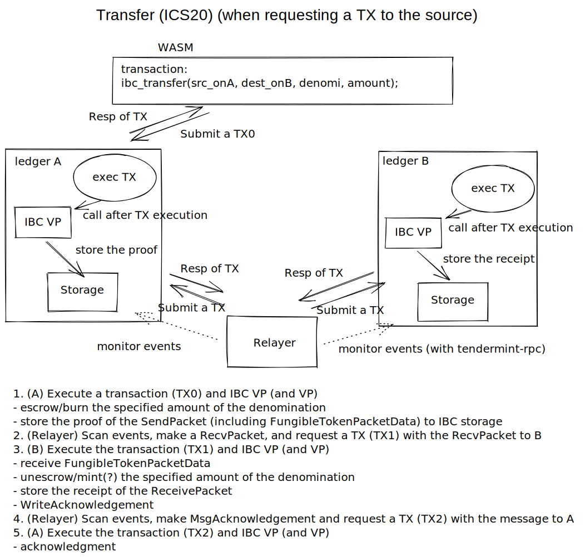

# IBC integration

[IBC](https://arxiv.org/pdf/2006.15918.pdf) allows a ledger to track another ledger's consensus state using a light client. IBC is a protocol to agree the consensus state and to send/receive packets between ledgers.

## IBC validity predicate
IBC validity predicate verifies the ledger state and the IBC modules by interacting with the IBC handler, and updates values according to IBC message. Also, it makes a packet, store proofs which can be proven later, and emit an IBC event to be scanned by a relayer.

IBC validity predicate is executed after a transaction has written IBC-related state. It is given an IBC request which specifies what to do. Because the request has been encoded and there are some types of messages, it has to check what request is given first and then decodes the message or packet. After the process according to the message, it emits an IBC event.

For the performance, IBC validity predicate is a [native validity predicate](vp.md#native-vps) that are built into the ledger.

```rust
pub struct IbcVp {
    ibc_ctx: IbcContext,
}

impl NativeVp for IbcVp {
    const ADDR: InternalAddress = InternalAddress::Ibc;

    fn init_genesis_storage<DB, H>(storage: &mut Storage<DB, H>)
    where
        DB: storage::DB + for<'iter> storage::DBIter<'iter>,
        H: StorageHasher
    {
        ...
    }

    fn validate_tx<DB, H>(
        ctx: &mut Ctx<DB, H>,
        tx_data: &[u8],
        _keys_changed: &HashSet<Key>,
        _verifiers: &HashSet<Address>,
    ) -> bool
    where
        DB: storage::DB + for<'iter> storage::DBIter<'iter>,
        H: StorageHasher
    {
        let message: = Msg::try_from_slice(&tx_data[..]) {
            ...
        };
        let result = match message.type_url.as_str() {
            // decode each message: refer to `ibc-rs`
            create_client::TYPE_URL => {
                let domain_msg = create_client::MsgCreateAnyClient::decode_vec(&any_msg.value)
                    .map_err(|e| Kind::MalformedMessageBytes.context(e))?;
                ...
            }
            // other messages
            ...
        };
        match &result {
            Ok(output) => {
                emitEvent(output.events);
                true
            }
            Err(e) => {
                ...
                false
            }
        }
    }
}

pub struct IbcContext {...}

// ICS 2
impl ClientReader for IbcContext {...}
impl ClientKeeper for IbcContext {...}
// ICS 3
impl ConnectionReader for IbcContext {...}
impl ConnectionKeeper for IbcContext {...}
// ICS 4
impl ChannelReader for IbcContext {...}
impl ChannelKeeper for IbcContext {...}
// ICS 5
impl PortReader for IbcContext {...}
// ICS 18 (for relayer)
impl Ics18Context for IbcContext {...}
```

### Make a packet
IBC validity predicate given some messages would make a packet and send it. For example, when IBC validity predicate is given `MsgTransfer` for transfer between ledgers, it should make a packet including `FungibleTokenPacketData` to specify the sender, receiver, token, amount.

### Store a proof and state
These proofs can be stored to the storage on the ledger. It should be prefixed (e.g. `ibc/`) to protect them from other storage operations. The paths(keys) for Tendermint client are defined by [ICS 24](https://github.com/cosmos/ibc/blob/master/spec/core/ics-024-host-requirements/README.md#path-space).

### Emit IBC event
IBC relayer can subscribe the ledger with Tendermint RPC. The ledger should set IBC events to `events` in the response to allow for relayers to get the events.

### IBC context
IBC context provides functions to handle IBC modules. IBC validity predicate handles IBC modules through IBC context. [ibc-rs](https://github.com/informalsystems/ibc-rs) defines functions required by these operations. IBC context should implement these functions. For example, `ClientReader` is defined for the read-only part of the client (ICS 2). It has functions for the client module; `client_type()`, `client_state()`, `consensus_state()`, and `client_counter()`.

## Transaction for IBC
A requester (relayers or users) who wants to execute IBC operations sets IBC packet or message like `MsgCreateAnyClient` as transaction data and submit the following transaction. IBC validity predicate is invoked after this transaction execution by `insert_verifier()` to add an address for IBC `InternalAddress::Ibc`.

```rust
#[transaction]
fn apply_tx(_tx_data: Vec<u8>) {
    insert_verifier(InternalAddress::Ibc);
}
```

## Relayer (ICS 18)
IBC relayer monitors the ledger, gets the status, state and proofs on the ledger, and requests transactions to the ledger via Tendermint RPC according to IBC protocol. For relayers, the ledger has to make a packet, emits an IBC event and stores proofs if needed. And, a relayer has to support Anoma ledger to query and validate the ledger state. It means that `Chain` in IBC Relayer of [ibc-rs](https://github.com/informalsystems/ibc-rs) should be implemented for Anoma.

```rust
impl Chain for Anoma {
    ...
}
```

## Transfer (ICS 20)

