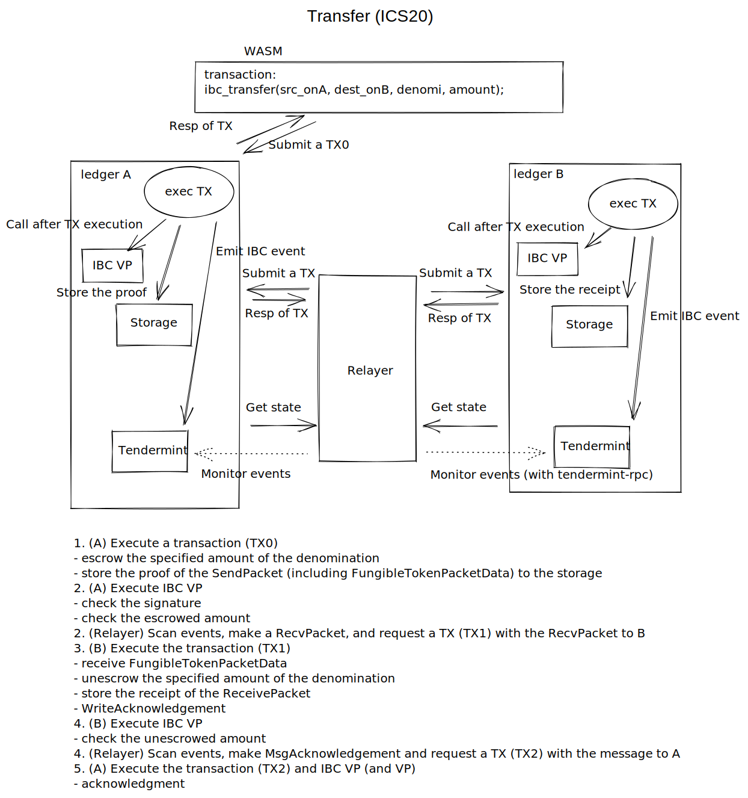

# IBC integration

[IBC](https://arxiv.org/pdf/2006.15918.pdf) allows the ledgers to interact with each other. IBC is a protocol to agree the consensus state and to send/receive packets between ledgers.

## IBC validity predicate
The validity predicate interacts with the IBC handler to verify the ledger state and the IBC modules, and update values according to IBC message or packet. For the performance, the code should be Rust native code unlike usual validity predicates are WASM. It is executed after all transaction executions.

There are two types of transactions invoking IBC validity predicate. One is a transaction submitted by a relayer. The transaction has an IBC message like `MsgCreateAnyClient`. IBC validity predicate has to call functions with IBC handler. The other is a transaction calling a function e.g. `ibc_write()` to update a value on another ledger.

IBC validity preficate executes functions with IBC handler. It would make a packet and emit an IBC event to be scanned by a relayer, and store proofs which can be proven later. These proofs are stored according to ICS 24.

### IBC request
IBC request notifies the ledger to call IBC validity predicate. A transaction stores the request for IBC to an IBC request list instead of the storage into which other updates are written. These requests are not persisted into the DB on the ledger. After the all transactions are executed, the ledger calls IBC validity predicate.

We have the write log to store updates or deletes before commit. A transaction should be able to store an update for another ledger into the write log. The log of the update should be a different modification type from other updates to the same ledger, e.g. `StorageModification::IbcRequest`. At the end of the transaction execution, when the write log has these requests, the ledger calls IBC validity predicates.

### Emit IBC event
Relayer can subscribe the ledger with Tendermint RPC. Anoma ledger needs to set an IBC event to `events` in the response.

### Client (ICS 2)

### Connection (ICS 3)

### Channel (ICS 4)

### Transfer (ICS 20)

## Relayer (ICS 18)
Relayer monitors the ledger and reuqests transactions to the ledger according to IBC protocol. For relayers, the ledger has to make a packet, emits an IBC event and stores proofs if needed. And, a relayer has to support Anoma ledger to query and validate the ledger state.
